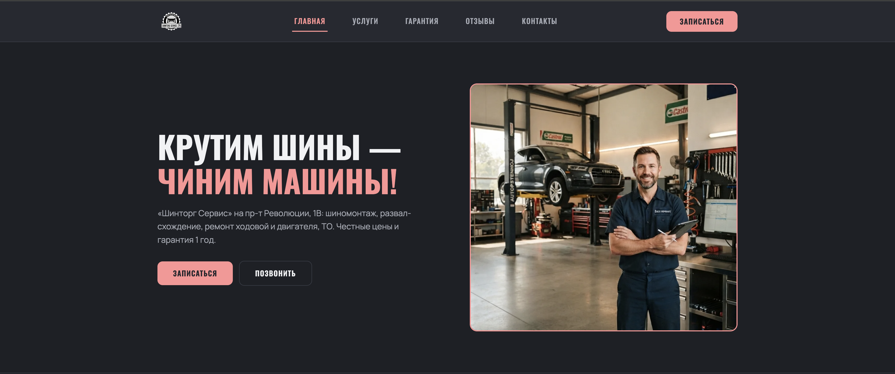
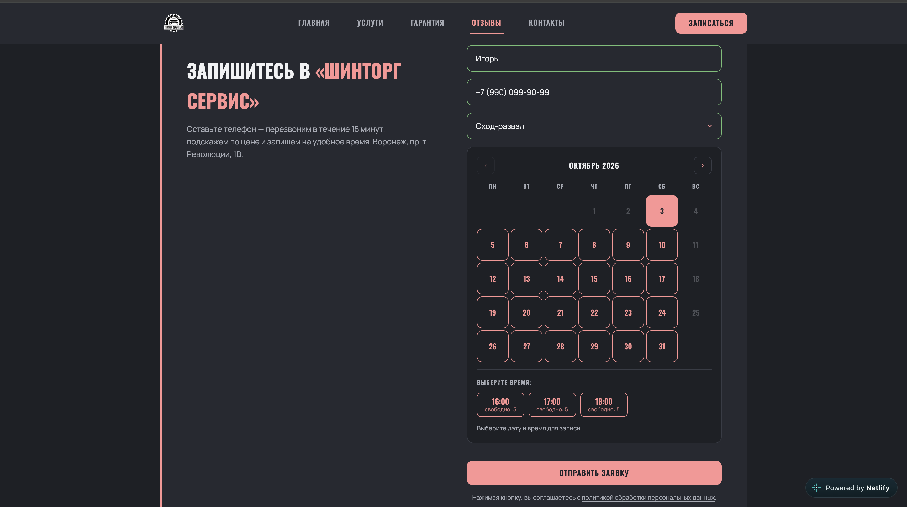
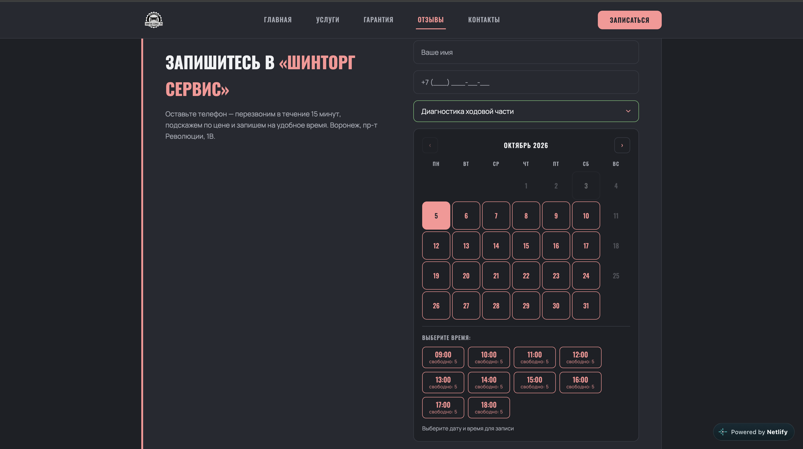
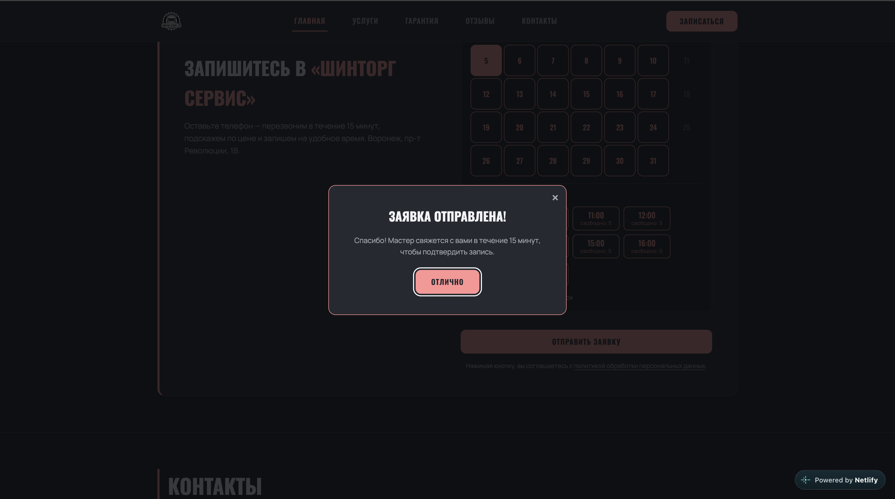
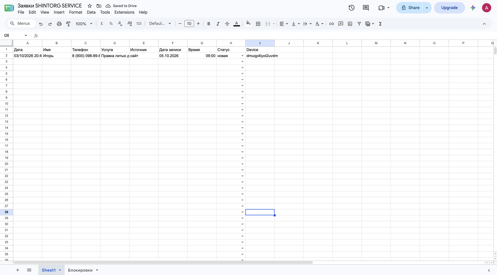
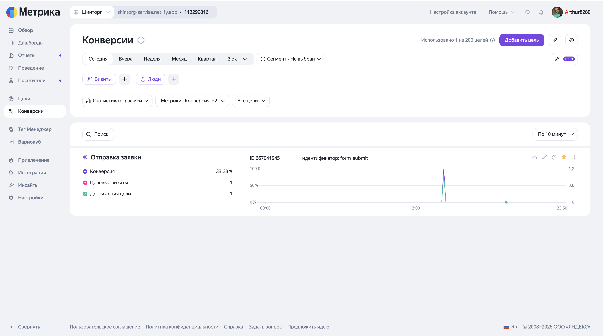
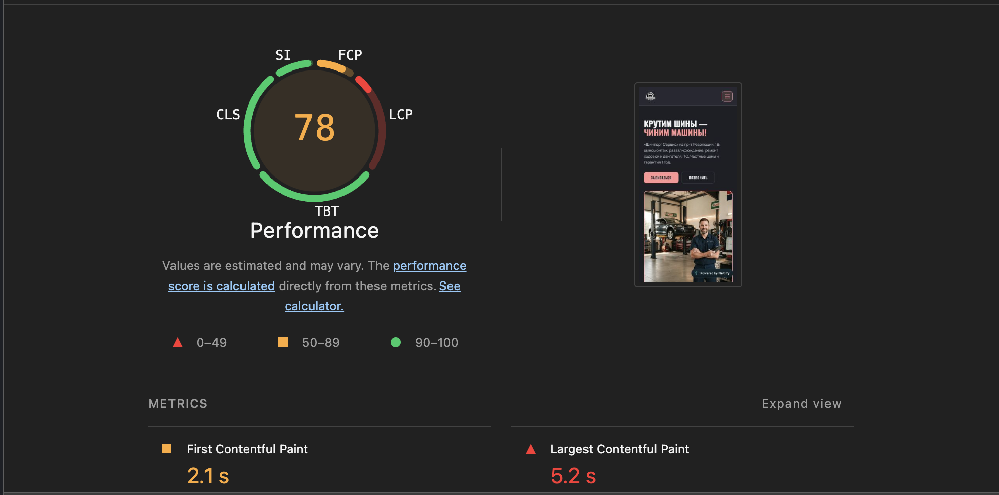
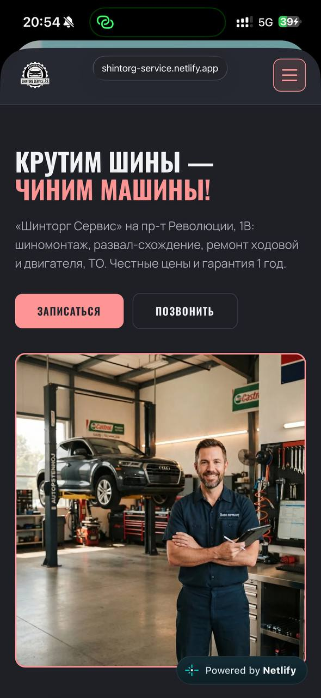

# Кейс: Шинторг Сервис — сайт с онлайн-записью для автосервиса

**Живой сайт:** https://shintorg-service.netlify.app

## Задача

Автосервис в Воронеже. Классическая боль бизнеса: клиенты звонят и пишут
в мессенджеры, мастер отрывается от работы, записи теряются, загрузка
постов держится «по памяти». Нужен был не сайт-визитка, а инструмент:
клиент сам выбирает услугу, дату и время, сервис мгновенно получает
заявку и видит реальную занятость.

## Решение

Одностраничный сайт с каталогом услуг и ценами + система онлайн-записи
с живым календарём. Слоты считаются на сервере из реальных заявок.

## Что умеет система

**1. Живое расписание.** Клиент видит свободные даты и время («свободно: 5»).
Каждая заявка уменьшает счётчик, заполненный слот закрывается автоматически.

**2. Защита от перегруза.**

- одна активная заявка на номер (новая открывается после завершения текущей);
- лимит «1 запись в час» на услуги, требующие отдельного поста
  (компьютерная диагностика, сход-развал).

**3. Заявки мгновенно в Telegram + дубль в Google Sheets.** Каждая заявка —
строка в таблице со статусом (новая / в работе / завершено).

**4. Админка без единой строчки кода.** Владелец закрывает слоты под
офлайн-записи, открывает выходные дни, меняет статусы — всё прямо
в Google Sheets. Сайт подхватывает изменения мгновенно.

**5. Аналитика.** Яндекс Метрика с целью «Отправка заявки» — владелец видит
конверсию: сколько визитов превратились в записи.

## Техническая сторона

- **Фронт:** HTML / CSS (BEM) / JavaScript, модульная архитектура
- **Бэкенд:** Google Apps Script — без сервера и абонентной платы,
  Google Sheets работает как база данных
- **Хостинг:** Netlify с автодеплоем из GitHub
- **SEO:** мета-разметка, микроразметка AutoRepair (JSON-LD), sitemap.xml.
  Lighthouse: **SEO 100/100**, Accessibility 91

## Мобильная версия

Большая часть клиентов автосервиса — с телефона. Запись работает
на любом экране.

## Почему это не «просто лендинг»

Сайт — видимая часть. Под капотом — система записи с бизнес-логикой
(дубли номеров, почасовые лимиты, блокировки слотов, статусы),
защитой от гонок (LockService) и админкой для человека без
технического образования.

## Автор

Артур — frontend/web-разработчик. Делаю сайты, которые не просто «есть»,
а работают на бизнес: запись, заявки, аналитика.
