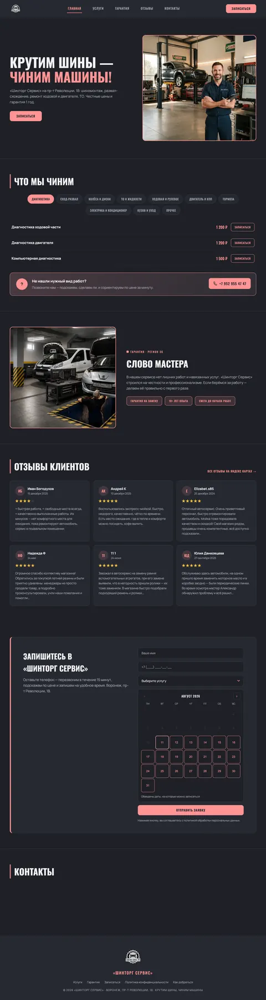

# 🚗 Шинторг Сервис

Адаптивный коммерческий сайт автосервиса **«Шинторг Сервис»** в Воронеже с онлайн-записью и живым расписанием.

<p align="center">
  <a href="https://ar4i23.github.io/shintorg_service/">
    
  </a>
</p>

<p align="center">
  <a href="https://ar4i23.github.io/shintorg_service/">🌐 Live Demo</a>
</p>

---

## 🎯 Цель проекта

Сайт построен вокруг коммерческого сценария:

**услуга → цена → доверие → выбор даты/времени → заявка → обработка заявки.**

Главная задача интерфейса — не просто показать услуги, а сократить путь пользователя до записи.

## 🛠 Tech Stack

- HTML5
- CSS3
- JavaScript ES6+ / ES Modules
- BEM
- Flexbox / CSS Grid
- Responsive Design
- CSS Custom Properties
- Git / GitHub
- Google Apps Script — бэкенд: заявки, расписание, проверки
- Google Sheets — база данных и админка для заказчика
- Telegram Bot API — мгновенные уведомления о заявках

## ⚡ Реализовано

- адаптивная версия Desktop / Tablet / Mobile;
- модульная структура JavaScript;
- BEM-структура CSS;
- каталог услуг с категориями;
- форма записи с валидацией (маска телефона, автокапитализация имени);
- календарь и выбор времени с **живым расписанием**: слоты считаются на сервере
  из реальных заявок («свободно: 5» → 4 → 3);
- проверка доступности слотов;
- защита от перегруза сервиса: одна активная заявка на номер
  (авто-разблокировка после завершения записи), лимит «1 запись в час»
  на компьютерную диагностику и сход-развал;
- защита интерфейса от повторной отправки;
- слоты обновляются сразу после заявки, без перезагрузки страницы;
- заявки мгновенно падают в **Telegram** и дублируются в **Google Sheets**;
- **админка без кода**: заказчик закрывает слоты под офлайн-записи, открывает/
  закрывает дни и ведёт статусы (новая / в работе / завершено) прямо в таблице;
- отзывы и ссылка на Яндекс Карты;
- телефонная связь;
- базовая SEO-разметка;
- Open Graph;
- accessibility-атрибуты для интерактивных элементов;
- оптимизированные изображения WebP;
- отдельная страница политики обработки персональных данных.

## 🧩 Архитектура

```text
shintorg_service/
├── css/
│   ├── style.css
│   ├── base.css
│   └── blocks/
├── js/
│   ├── main.js
│   └── modules/
├── img/
├── index.html
├── privacy.html
├── README.md
├── AUDIT.md
├── CHANGELOG.md
└── .gitignore
```

JavaScript разделён по зонам ответственности: навигация, бургер, вкладки, модальные окна, календарь, форма, валидация, слайдер и анимации.

**Схема работы записи:**

```text
Клиент на сайте
   → POST заявка → Google Apps Script
        → проверки (дубль номера / лимит 1 в час / блокировки / вместимость)
        → строка в Google Sheets (статус «новая»)
        → уведомление в Telegram
   → GET расписание ← Apps Script считает занятость из таблицы

Заказчик: меняет статусы и закрывает слоты в таблице — сайт подхватывает мгновенно
```

## 🔐 Важное по заявкам

Фронтенд отправляет заявку во внешний endpoint Google Apps Script. Секретные ключи Telegram **не находятся в HTML/JS и не публикуются в GitHub** — токен и chat_id хранятся в Script Properties проекта.

Доставка заявок настроена: уведомление в Telegram + строка в Google Sheets. Ложного «успеха» при недоступном endpoint нет — интерфейс честно показывает ошибку и предлагает позвонить.

## 📈 Что ещё нужно перед боевым запуском

1. Реальный домен клиента и canonical/OG URL под него.
2. Финальный текст политики обработки персональных данных и сведения об операторе.
3. Мобильное тестирование на реальных устройствах.
4. Lighthouse / Core Web Vitals после публикации.
5. Аналитика отправок формы и звонков (Яндекс Метрика с целями).
6. Ограничение частоты запросов / защита от спама (honeypot или секретный ключ в Apps Script).

## 👨‍💻 Автор

**Артур — Frontend / Web Developer**

HTML · CSS · JavaScript · React · Node.js · Python · REST API · Git

**Направление развития:** Frontend → Full-stack → Python → API → Automation → AI
